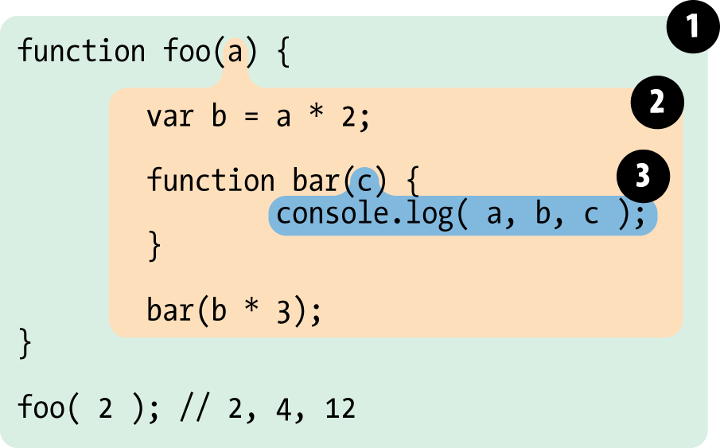

# General

## JSON stringification
We can use the built in `JSON.stringify()` method to convert a JS object or value to a JSON string. This is useful for saving complex data types in a database, sending data to an API or saving into local storage.

``` js
JSON.stringify({ name: "diego", age: 22 }); // '{"name": "diego","age":22}'

JSON.stringify([1, 2]); // '[1,2]'
```

## `null` vs `undefined`
`null` references a empty or non-existent value. `undefined` is just that a variable has been declared, but not defined.

``` js
let dontExist = null // must be explicitly set as null

let notDefined; //undefined

let obj = {};

obj.someProperty // undefined

if(notDefined !== undefined) { // not recommmended, since null !== undefined is true
    // ...
}

if(notDefined) { // Better, check for truthy/falsy conditions
    // ...
}
```

## Built-in types
JS comes with these built in types:

``` js
const boolean = true;

const nullType = null;

const undefinedType = undefined;

const number = 1;

const bigInt = BigInt(Number.MAX_SAFE_INTEGER);

const string = "I'm a string!";

const symbol = Symbol("Sym");

const object = {}
```

## Closures
Closures are the combination of a function and its surrounding state/scope. They are made when a function is created, during function creation time. (function within a function gaining access to the surrounding function's scope)

``` js
function makeAcumulator() {
    let acum = 0;

    function acumulate(number) {
        acum += number;
        return acum;
    }

    return acumulate;
}

const acumulator = makeAcumulator();
const anotherAcumulator = makeAcumulator();

acumulator(2) // 2
acumulator(5) // 7
acumulator(1) // 8

anotherAcumulator(4) // 4
anotherAcumulator(2) // 6
anotherAcumulator(1) // 7
```

## Function vs block scope
When a variable is declared within a function, it can only be accessed within it, this is called Function Scope. When a variable is declared in a block (if / switch, etc) it can only be accessed within this block, unless it was declared with the `var` keyword, in that case it can be subsequently accessed in the outer scope following the block.

``` js
function myFunction() {
    let functionScopeLet = 'I only exist in the function!';
    const functionScopeConst = 'Me too!';
    var functionScopeVar = 'Me three!';

    if(true) {
        const blockScopeConst = 'I only exist in the "if" block!';
        let blockScopeLet = 'Me too!';
        var blockScopeVar = 'I can also be accessed outside of the "if" block!';

        console.log(functionScopeLet); // 'I only exist in the function!'
        console.log(functionScopeConst); //Me too!
        console.log(functionScopeVar); // Me three!

        console.log(blockScopeConst); // I only exist in the "if" block!
        console.log(blockScopeLet); // Me too!
        console.log(blockScopeVar); // I can also be accessed outside of the "if" block!
    }

        console.log(functionScopeLet); // 'I only exist in the function!'
        console.log(functionScopeConst); //Me too!
        console.log(functionScopeVar); // Me three!

        console.log(blockScopeVar); // I can also be accessed outside of the "if" block!
        console.log(blockScopeConst); // Throws Error
        console.log(blockScopeLet); // Throws Error
}
```

## Natives

_TODO_

## First class functions
JS treats functions as "first-class citizens", in other words, it treats them as any other variable. They can be assigned to a variable, passed to and returned from another function.

``` js
const sayHello = () => console.log("Hello there");

function executeFunction(paramFuction) {
    paramFuction();
}

executeFunction(sayHello); // Hello there

function makeNewFunction() {
    const newFunction = () => {
        console.log("Hello World");
    }

    return newFunction;
}
```

## Boxing & unboxing
Boxing refers to wrapping an object around a primitive value, in order to gain access to useful methods. Unboxing is the inverse process, gaining a primitive from a boxing object.

``` js
const primitive = "Hello";

// automatic boxing
console.log(primitive.toUpperCase()) // HELLO

// manual boxing
const manualBox = new Number(2); // Number {2}

// unboxing
const unBox = manualBox.valueOf(); // 2
```

## Dynamic scope vs lexical scope
With Dynamic scope, you would search in the local function first, then in the function that called the local function, then in the function that called that function, and so on, up the call-stack.

JS uses Lexical scope, so it is based on where variables and blocks of scope are authored and are set in stone at runtime.

_If JS used Dynamic Scope_
``` js
function foo() {
	console.log( a ); // 3  (not 2!)
}

function bar() {
	var a = 3;
	foo();
}

var a = 2;

bar();
```

_Lexical scope_ from _Kyle Simpson’s book — You don’t know JS, Scope&Closures_


